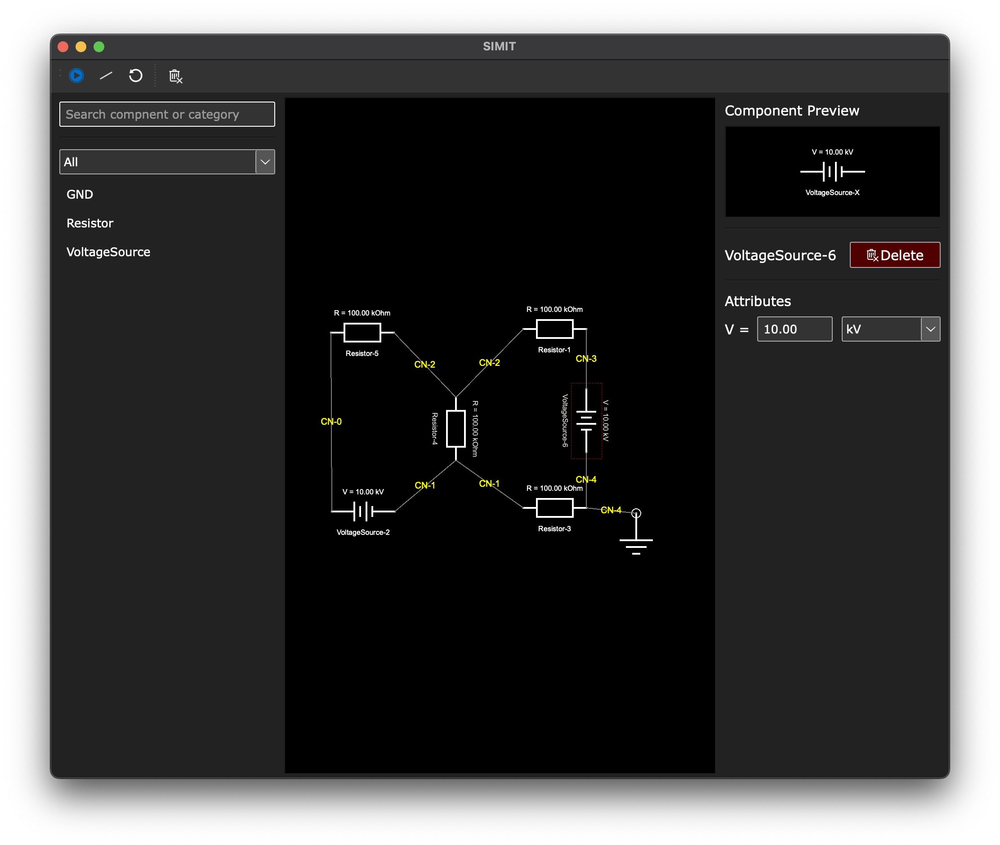

# simit

 
<a href="https://github.com/psf/black">
    
</a>

<p style="color: orange;">
An electronic circuit simulation software, based on NGSpice simulation engine, built using Python and Qt.
</p>

NGSpice is an open-source electric and electronic circuit simulator. Unfortunately, NGSpice does not have a Graphical User Interface (GUI), making it difficult to use for non-experts and those who are unfamiliar with the command-line interface.

The goal of this project is to freely make available EDA software for electronic engineers, students and hobbyist who are interested in electronic circuit simulation. Since NGSpice is already open-source, the aim is to build a user friendly interface to enable schematic drawing. The drawn schematics can then be interpreted by our software and simulated using the NGSpice engine.

Currently, the software is still under development and there is no distributable file. In order to use it, follow the same steps listed out to developers for [setting up the software](#setting-up-the-software).

# readme content

1. [initial looks](#initial-looks-😎)
1. [setting up the software](#setting-up-the-software)

# initial looks 😎



# setting up the software

1. Clone the repository and navigate to the base directory

```shell
$ git clone https://github.com/trevenue44/simit.git
$ cd simit
```

2. Set up a Python environment to work in and activate it. Get more information on creating environments using Python's own [venv](https://docs.python.org/3/library/venv.html) or [conda](https://conda.io/projects/conda/en/latest/user-guide/tasks/manage-environments.html). I would recommend conda 👀.
   > Recommended Python version: 3.11.0
3. Install requirements

```shell
$ pip install -r requirements.txt
```

4.  `PySpice` requires NGSpice to be installed on the system for its operation. Installing the requirments above already installs the `PySpice` itself but not the NGSpice.

    4.1 Installing PySpice on windows

         <!-- already done by the requirments installation above -->
         $ pip install PySpice

         <!-- use the post-install tool to install the required ngspice Windows 64-bit DLL library -->
         $ pyspice-post-installation --install-ngspice-dll

         <!-- check for a successfull installation -->
         $ pyspice-post-installation --check-install

    4.2 Installing PySpice and NGSpice on other systems (OSX and Linux) : More information on appropriately installing the required NGSpice file for PySpice's operation is given on PySpice's website [here](https://pyspice.fabrice-salvaire.fr/releases/v1.5/installation.html).

    4.3 On MacOS, it is possible that even after following the steps listed in 4.2 above, PySpice would still not find the required `libngspice.dylib` in the right directory. In this case, you need to explicitly tell PySpice where to find this file. Do so by adding what's below to your environment variables. Using homebrew, the path would most likely be: `/opt/homebrew/lib`

        DYLD_LIBRARY_PATH=/path/to/dir/containing/file:$DYLD_LIBRARY_PATH

5.  Given that all the requirements are installed, you should now be ready to run the app. Run the app using. Make sure to run the app from the base directory else there might be some issues with the relative paths.

```shell
$ python src/app.py
```
